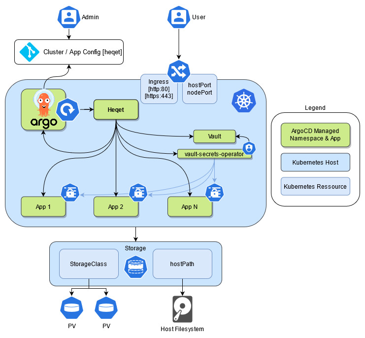

# Heqet

*Heqet (Egyptian ḥqt, also ḥqtyt "Heqtit") is an Egyptian goddess of fertility.*

Heqet is my attempt to make Kubernetes GitOps Deployments as easy as possible. It reduces the need of configuration by generating the required Application definitions for you. Heqet heavily relies on a Helm-Chart which will generate all applications, namespaces & more using ArgoCDs [App-of-Apps-Pattern](https://argoproj.github.io/argo-cd/operator-manual/cluster-bootstrapping/).

## Keyfeatures
 * Easy Setup [Sane Kubernetes cluster + PVC-StorageClass]
 * Easy application definition & configuration
 * Follows the GitOps principles
 * Deploy a whole application environment or cluster from a singe git-repo

**This project is still in a very early stage of development, but feel free to try it out & contribute!**

## Overview

## Components & Configuration

Core component is `ArgoCD` which will deploy Heqet & also your apps! All you need is a git-repo & k8s cluster.

The heqet Helm-Chart will generate ArgoCD Applications, namespaces and if required vault Secrets. All you need to do if add your Helm-Application to heqet's `values.yaml`. 

If more configuration values are required, simply throw your applications `values.yaml` into heqets `values.d` folder, named as the application [e.g. `values.d/argocd.yaml`.

## Installation

Installing heqet can't be simpler, after configuring your apps, argocd and pushing it to your git repo:

1. Configure `manifests/heqet-apps.yaml` to match your Setup
2. `kubectl apply -f manifests/argocd.yaml`
3. `kubectl apply -f manifests/heqet-apps.yaml`
 
ArgoCD will start and bootstrap heqet. 
